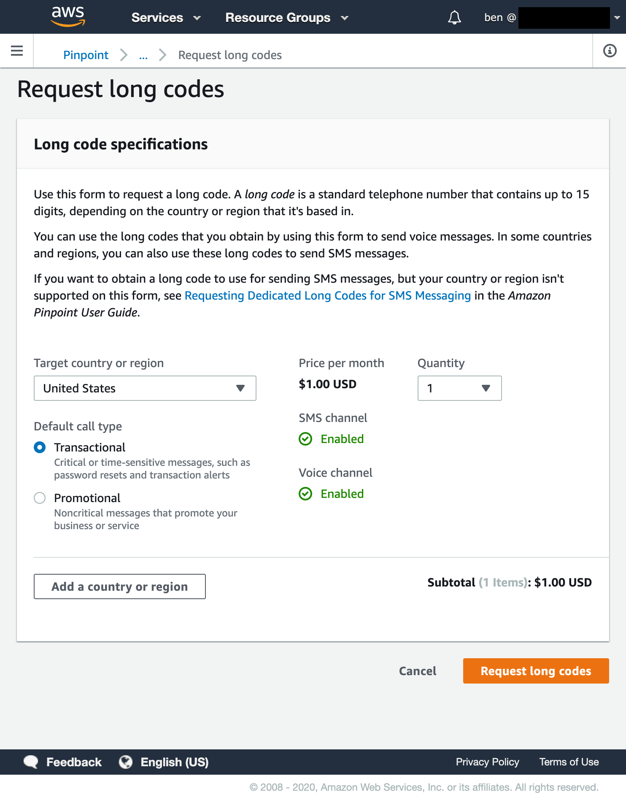
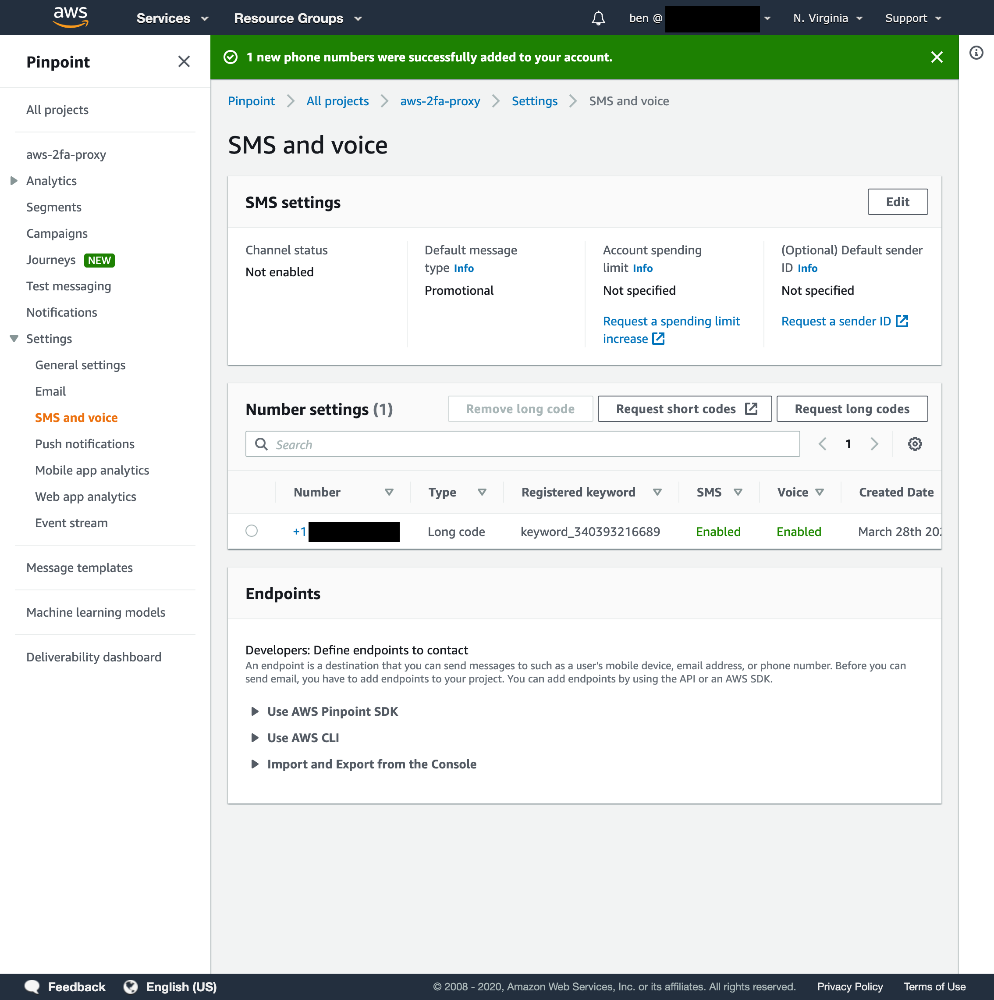
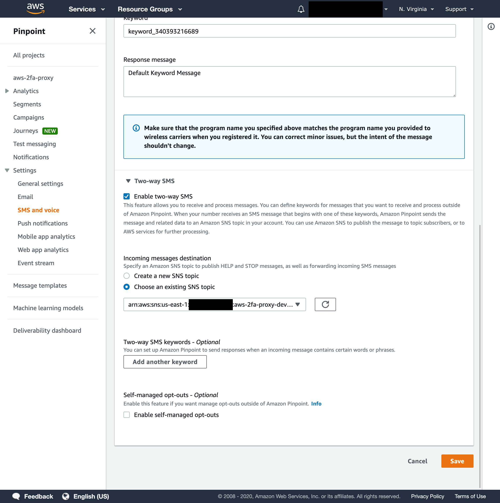
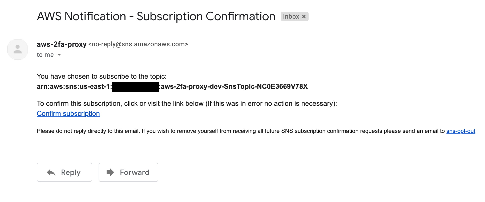
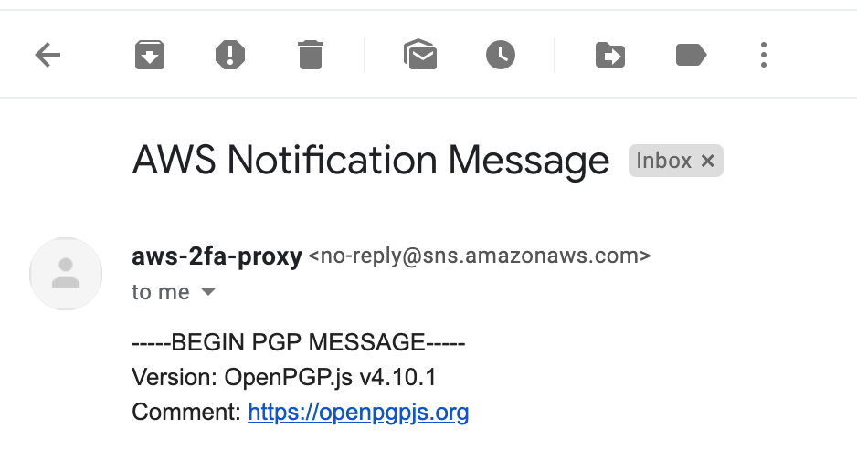

# The Concept

A number of companies make use of mobile "2FA" via SMS which is inherently insecure and easily bypassed by porting out of mobile numbers or sim swap attacks. 

There are a number of options to prevent this:
1. Go to a better Bank that has more secure 2FA support (OTP, U2F, Yubikeys or a mobile push to the app)
2. Get a burner phone and hope no one finds your number and tries a sim attack
3. Use this tool to setup a proxy number and stack in AWS for your mobile 2FA

## Get Started

1. Copy `config.yml.example` to `config.yml` and update email, number and public key
2. `npm install`
3. `AWS_PROFILE=profile npm run deploy` where `profile` is your AWS profile
4. Run local lambda connecting to AWS by: `AWS_PROFILE=profile TOPIC_ARN=arn npm run test:e2e` where `TOPIC_ARN` is the receiving topic of used by the Lambda
5. Register long code in AWS Pinpoint and setup SNS topic to the forwarding topic
6. Make use of your new mobile number in Pinpoint and wait for encrypted payloads!

# How it Works?

- Register your proxy number (long code) via AWS Pinpoint
- Proxy number resides in AWS Pinpoint 
- Messages received on AWS Pinpoint forwarded to SNS then AWS Lambda function for processing
- The Lambda encrypts the message with `openpgp` and forwards these messages via SNS securely to their destination
- Current solution makes use of encrypted SMS or Email (other options could be Signal, Slack or Telegram)

# Assumptions

- AWS will secure your registered number and porting out or control of this number will not give visibility of 2FA codes
- The communication within AWS is secure and much more difficult to break if your AWS account is secured by 2FA and locked down according to AWS security best practices

# SMS

### Requesting a long code

### Click your long code to configure

### Enabling Two-way SMS and forwarding to the 2FA Receiver Topic
Be sure to select the receiver topic

# Email

### Confirming SNS subscription once stack is deployed 

### Encrypted Email
